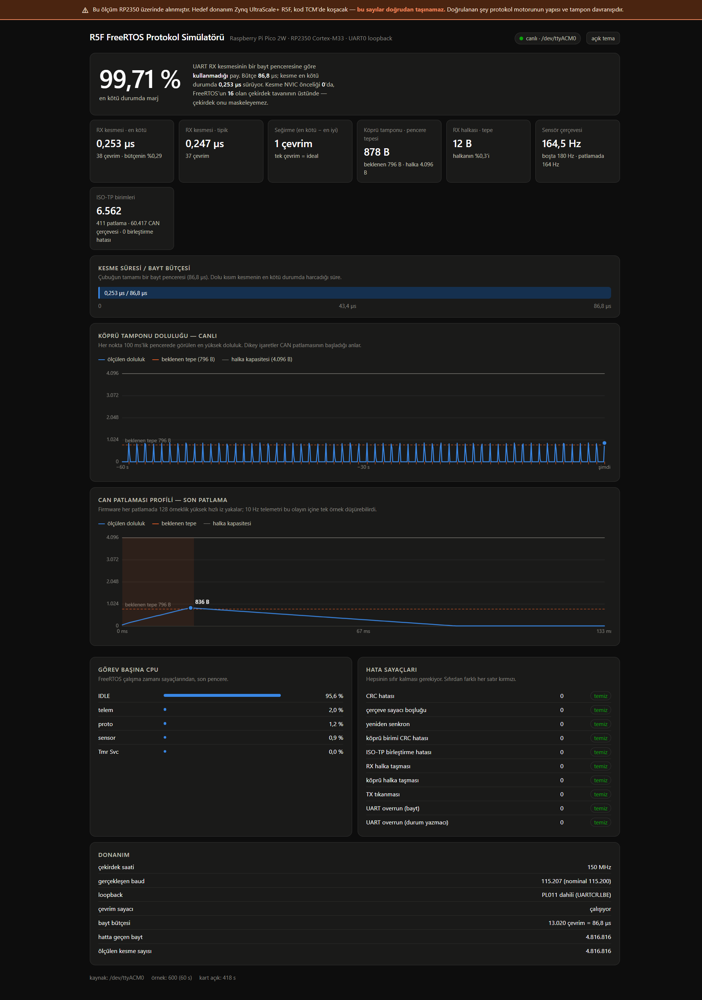

# R5F FreeRTOS Protocol Simulator

A protocol bridge that belongs on a lockstep Cortex-R5F inside a Zynq UltraScale+,
running instead on a Raspberry Pi Pico 2W so that its structure and its buffer
behaviour can be measured on hardware I actually have.

> **The timing numbers here do not transfer to the target.** The target is a
> lockstep Cortex-R5F running out of tightly coupled memory; this is a
> Cortex-M33 running out of SRAM behind a flash cache. What transfers is the
> code under `firmware/src/engine/`, the structure of the protocol engine, and
> the buffer behaviour under load. The dashboard says so too, in a banner that
> cannot be scrolled away.



## What it measures

Everything below is measured on the board, not calculated. Numbers are from a
70 second run with the CAN side active; `docs/olcumler.md` has the full table
and the method.

| | measured | predicted |
|---|---|---|
| UART RX interrupt, typical | **37 cycles / 0.247 µs** | — |
| UART RX interrupt, worst case | **38 cycles / 0.253 µs** | — |
| jitter (worst − best) | **1 cycle** | — |
| byte deadline | 13 020 cycles / 86.8 µs | 86.8 µs |
| **worst-case margin** | **99.71 %** (343× headroom) | — |
| line throughput | 11 521 B/s | 11 520 B/s |
| sensor frame rate, idle | 180.0 Hz | 180 Hz |
| sensor frame rate, under CAN load | **164.2 Hz** | **164 Hz** |
| CAN frames per burst | 147 | 147 |
| bridge payload per burst | 1 024 B | 1 024 B |
| ISO-TP units reassembled | 16 per burst, 0 failures | 16 |
| **peak bridge backlog** | **877 B** | 796 B → **798–885 B** (see below) |
| remaining ring margin | 4.7× | ~5× |
| CRC errors, counter gaps, overruns, overflows, stalls | **0** | 0 |

## The two things measurement found that arithmetic did not

**1. The worst case is set by where the code lives, not by what it does.**

With the interrupt's callees left in execute-in-place flash, the receive
interrupt cost 42 cycles typically and **152 in the worst case** over 690 000
samples. That 110-cycle spread is not work — it is a flash cache miss. Moving
them into SRAM:

| | in flash | in SRAM |
|---|---|---|
| typical | 42 cycles | 38 cycles |
| **worst case** | **152 cycles** | **39 cycles** |
| jitter | 110 cycles | **1 cycle** |

This is the finding that transfers most directly. The specification says the
bridge will run out of TCM on the R5F; this is what that decision is worth,
measured.

**2. The 796-byte prediction is right to within 10 %, and the difference is
framing.**

The arithmetic — 1024 bytes in, 228 drained during the 19.845 ms burst, 796
left over — assumes a byte can leave the instant it arrives. Two things on a
real link delay the drain:

- The bridge cannot transmit half a unit. The first 64-byte unit is not
  complete until eight consecutive frames have arrived: nine slots, 1.215 ms.
- It cannot cut into a sensor frame already on the wire, so it waits up to one
  whole frame: 63 byte times, 5.47 ms.

The drain therefore starts between 1.215 ms and 6.683 ms into the burst, which
puts the peak between 810 and 873 bytes. The burst trace samples every 12 byte
times, so an observed peak can sit 12 bytes either side: **798 to 885**. All 69
captured bursts landed inside that band. The 4096-byte ring keeps 4.7× margin.

## How it works

```
  ┌──────────────── Raspberry Pi Pico 2W (RP2350) ─────────────────┐
  │                                                                │
  │  sensor task ──► sensor ring ──┐                               │
  │   2+1+59+2 B       256 B       │                               │
  │   CRC-16                       ├──► byte tick IRQ ──► UART0 TX │
  │                                │    every 86.8 µs        │     │
  │  CAN sim IRQ ──► bridge ring ──┘    unit-atomic          │     │
  │   135 µs slots     4096 B           bridge first    PL011 loop │
  │   147 frames                                             │     │
  │                                                          ▼     │
  │  protocol task ◄── rx ring ◄──────── UART RX IRQ ◄─── UART0 RX │
  │   demultiplex        4096 B          NVIC priority 0           │
  │   verify CRC                         above the kernel ceiling  │
  │   answer requests                                              │
  │                                                                │
  │  telemetry task ──────────────────────────────► USB CDC        │
  │   10 Hz, lowest priority, one JSON line              │         │
  └──────────────────────────────────────────────────────┼─────────┘
                                                         │
  ┌──────────────── NVIDIA Jetson Orin Nano ─────────────▼─────────┐
  │  server/app.py   reads /dev/ttyACM0, fans out over SSE :8000   │
  │  dashboard       one HTML file, canvas charts, no CDN          │
  └────────────────────────────────────────────────────────────────┘
                       │ Tailscale or plain LAN
                       ▼  phone / laptop browser
```

Priority order, most urgent first:

| | | |
|---|---|---|
| UART receive interrupt | NVIC `0x00` | above the FreeRTOS syscall ceiling of 16 — the kernel cannot mask it, and in exchange it calls no kernel API |
| byte tick interrupt | NVIC `0x40` | the 86.8 µs transmit slot and its arbiter |
| CAN slot interrupt | NVIC `0x80` | stimulus generator |
| protocol task | priority 4 | drains the receive ring, verifies, answers requests |
| sensor task | priority 3 | builds frames |
| telemetry task | priority 1 | never affects the numbers it reports |

Both periodic timers are PWM slices rather than the microsecond alarm, because
86.8 µs and 135 µs are exactly 13 020 and 20 250 core clock cycles at 150 MHz.
A 1 µs alarm would have had to alternate between 86 and 87 µs.

The UART FIFOs are switched off on purpose, so the receive interrupt fires once
per byte. The once-per-byte path is the thing that has to fit inside 86.8 µs on
the target.

## The portability claim

```
firmware/src/
  engine/          ← moves to the R5F unchanged
    engine.c   the bridge, the arbiter, the rings
    frame.c    64 byte units, CRC-16/CCITT, streaming demultiplexer
    isotp.c    the 147-frame ISO-TP burst
    ringbuf.h  lock-free single-producer / single-consumer ring
    metrics.h  min / mean / max cheap enough for an interrupt
  port/            ← the only layer that changes
    port.h            a nine-function contract, and nothing else
    port_rp2350.c     today: PL011, PWM slices, DWT cycle counter
    (port_r5f.c)      target: XUartPs, a Triple Timer Counter, the PMU counter
```

Nothing under `engine/` includes an SDK header. `PORT_HOT` marks the functions
that belong in fast memory — SRAM here, TCM on the target.

Every physical constant lives in `firmware/src/config.h` and the constants
check each other at compile time, so a typo breaks the build instead of quietly
changing what the project claims to have measured:

```c
_Static_assert(CAN_BURST_BYTES - UART_DRAIN_PER_BURST == EXPECTED_PEAK_BACKLOG,
               "expected peak backlog is not ingress minus drain");
```

The dashboard's reference lines come from the firmware's own telemetry rather
than from constants in the page, so `config.h` stays the single source of truth
all the way out to the browser.

## Hardware

- Raspberry Pi Pico 2W (RP2350, Cortex-M33, 150 MHz)
- A USB cable to a Linux host. That is all.

**No jumper is required.** UART0 loops back inside the PL011 through
`UARTCR.LBE`. The byte is still serialised and deserialised at 115200 baud, so
it still occupies the line for one byte time and still raises exactly one
receive interrupt — every number in this project is identical either way, and
nothing can fall out of the board on the way to a presentation.

To use a real wire instead, connect **GP0 (pin 1) to GP1 (pin 2)** and build
with `LOOPBACK_EXTERNAL` in `main.c`. The dashboard reports which mode is live.

Two optional probe pins for scope confirmation: **GP15** is high for the
duration of the receive interrupt, **GP14** for the duration of a CAN burst.

## Setup

One command, on the machine the Pico is plugged into:

```sh
./scripts/setup.sh
```

It installs an Arm toolchain, the Pico SDK and the FreeRTOS kernel under
`~/r5f-tools` (no root needed for those), then builds. Then:

```sh
./scripts/flash.sh              # copies the .uf2, resetting into BOOTSEL if needed
./scripts/install-service.sh    # dashboard as a systemd service on :8000
```

Or, without installing a service:

```sh
python3 server/app.py
```

The server needs **no dependencies at all** — `termios`, `http.server` and
`json` are standard library. No pip, no venv, nothing to install. That is
deliberate: this has to come up in a room with no internet.

## Viewing it

The server binds `0.0.0.0` and prints every address it can be reached on:

```
R5F protocol simulator dashboard on port 8000
    tailscale  http://100.122.7.119:8000
    lan        http://192.168.1.11:8000
    local      http://127.0.0.1:8000
```

**Tailscale is convenient, not required — and it will not work in a room with
no internet**, because the control plane is unreachable there. At a venue, use
the LAN address or a phone hotspot; the dashboard does not care which address
it is reached on, and Server-Sent Events reconnect on their own when the wifi
flaps.

Without a board attached:

```sh
python3 server/app.py --demo                    # synthesise a session
python3 server/app.py --replay logs/session.ndjson   # replay a real capture
```

## Reading the measurements

```sh
python3 scripts/analyze.py logs/session.ndjson
```

Prints every measured quantity next to what the specification predicts. The
service records to `logs/session.ndjson` continuously.

## Layout

```
firmware/     Pico SDK + FreeRTOS, C            50 KB flash, 118 KB RAM
server/       app.py, standard library only     ~430 lines
dashboard/    index.html, no external resource  one file
scripts/      setup, build, flash, service, analyze
docs/         olcumler.md - the measurement table and method (Turkish)
logs/         captured sessions
```

## What this is not

Not a CAN driver — the CAN side is software stimulus, deliberately, so that the
thing applying the load cannot be slowed down by the load it is applying. Not a
WiFi project: the Pico does nothing the target would not do, because a WiFi
stack next to a 86.8 µs interrupt budget would make the number it produces
indefensible. Not a benchmark of the RP2350.

## Licence

MIT.
